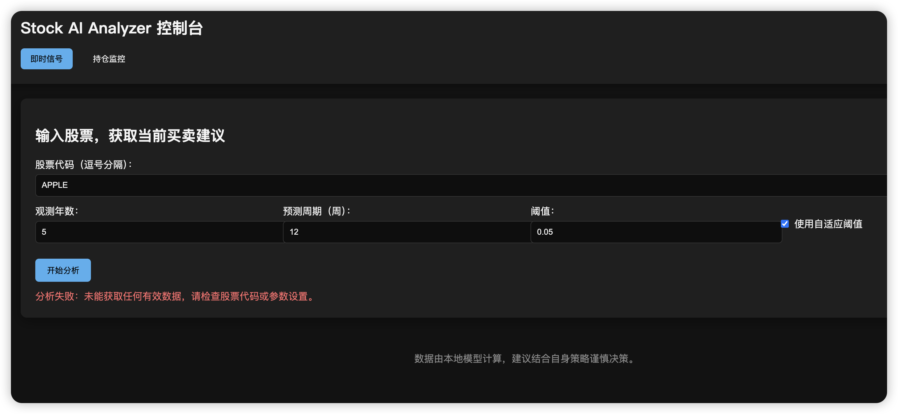

# Stock AI Analyzer Report

- Generated at: 2025-10-15 10:03:42 UTC
- Data coverage: 2022-09-11 → 2025-10-19 (frequency: weekly, horizon: 12 periods)
- Today: 2025-10-15
- Adaptive threshold enabled | Base threshold: 0.05 | Range: 0.01 - 0.06

## NVDA
- Latest date: **2025-10-19** | Price: **180.03** | Decision: **HOLD** | Score: -0.00
- Probabilities: buy 0.40 / hold 0.27 / sell 0.34 (gap 0.06) | Confidence: 0.07
- Indicator bias: SMA +1, RSI +0, MACD -1, Bollinger +0, Volume -1 | Mean -0.20

| Date | Decision | Price | Score | Prob Buy | Prob Hold | Prob Sell | Prob Gap | Confidence | Bias Avg |
| --- | --- | ---: | ---: | ---: | ---: | ---: | ---: | ---: | ---: |
| 2025-09-21 | hold | 176.67 | 0.11 | 0.37 | 0.25 | 0.38 | 0.01 | 0.06 | +0.40 |
| 2025-09-28 | buy | 178.19 | 0.17 | 0.42 | 0.22 | 0.36 | 0.05 | 0.10 | +0.40 |
| 2025-10-05 | buy | 187.62 | 0.17 | 0.41 | 0.23 | 0.36 | 0.05 | 0.09 | +0.40 |
| 2025-10-12 | buy | 183.16 | 0.24 | 0.43 | 0.25 | 0.32 | 0.12 | 0.14 | +0.40 |
| 2025-10-19 | hold | 180.03 | -0.00 | 0.40 | 0.27 | 0.34 | 0.06 | 0.07 | -0.20 |

## VTI
- Latest date: **2025-10-19** | Price: **326.83** | Decision: **BUY** | Score: 0.18
- Probabilities: buy 0.44 / hold 0.24 / sell 0.32 (gap 0.12) | Confidence: 0.11
- Indicator bias: SMA +1, RSI +0, MACD +1, Bollinger +0, Volume -1 | Mean +0.20

| Date | Decision | Price | Score | Prob Buy | Prob Hold | Prob Sell | Prob Gap | Confidence | Bias Avg |
| --- | --- | ---: | ---: | ---: | ---: | ---: | ---: | ---: | ---: |
| 2025-09-21 | hold | 327.53 | 0.07 | 0.42 | 0.23 | 0.35 | 0.07 | 0.05 | +0.00 |
| 2025-09-28 | hold | 326.27 | 0.14 | 0.41 | 0.21 | 0.38 | 0.02 | 0.08 | +0.40 |
| 2025-10-05 | buy | 329.97 | 0.25 | 0.46 | 0.21 | 0.33 | 0.13 | 0.15 | +0.40 |
| 2025-10-12 | hold | 321.80 | 0.04 | 0.31 | 0.24 | 0.45 | 0.14 | 0.19 | +0.60 |
| 2025-10-19 | buy | 326.83 | 0.18 | 0.44 | 0.24 | 0.32 | 0.12 | 0.11 | +0.20 |

## TSLL
- Latest date: **2025-10-19** | Price: **19.30** | Decision: **HOLD** | Score: 0.03
- Probabilities: buy 0.50 / hold 0.08 / sell 0.41 (gap 0.09) | Confidence: 0.09
- Indicator bias: SMA -1, RSI +0, MACD +1, Bollinger +0, Volume -1 | Mean -0.20

| Date | Decision | Price | Score | Prob Buy | Prob Hold | Prob Sell | Prob Gap | Confidence | Bias Avg |
| --- | --- | ---: | ---: | ---: | ---: | ---: | ---: | ---: | ---: |
| 2025-09-21 | hold | 19.54 | 0.08 | 0.51 | 0.13 | 0.36 | 0.14 | 0.13 | -0.20 |
| 2025-09-28 | hold | 20.71 | 0.06 | 0.49 | 0.14 | 0.37 | 0.12 | 0.11 | -0.20 |
| 2025-10-05 | hold | 19.63 | 0.09 | 0.52 | 0.11 | 0.37 | 0.15 | 0.13 | -0.20 |
| 2025-10-12 | buy | 17.96 | 0.22 | 0.58 | 0.07 | 0.35 | 0.22 | 0.16 | +0.00 |
| 2025-10-19 | hold | 19.30 | 0.03 | 0.50 | 0.08 | 0.41 | 0.09 | 0.09 | -0.20 |

## ROKU
- Latest date: **2025-10-19** | Price: **94.40** | Decision: **HOLD** | Score: -0.04
- Probabilities: buy 0.37 / hold 0.16 / sell 0.47 (gap 0.10) | Confidence: 0.10
- Indicator bias: SMA +1, RSI +0, MACD +1, Bollinger +0, Volume -1 | Mean +0.20

| Date | Decision | Price | Score | Prob Buy | Prob Hold | Prob Sell | Prob Gap | Confidence | Bias Avg |
| --- | --- | ---: | ---: | ---: | ---: | ---: | ---: | ---: | ---: |
| 2025-09-21 | hold | 101.78 | -0.12 | 0.26 | 0.24 | 0.50 | 0.24 | 0.22 | +0.40 |
| 2025-09-28 | hold | 99.60 | -0.12 | 0.26 | 0.24 | 0.50 | 0.24 | 0.23 | +0.40 |
| 2025-10-05 | hold | 103.85 | 0.05 | 0.38 | 0.23 | 0.39 | 0.01 | 0.04 | +0.20 |
| 2025-10-12 | buy | 92.02 | 0.18 | 0.43 | 0.19 | 0.38 | 0.06 | 0.10 | +0.40 |
| 2025-10-19 | hold | 94.40 | -0.04 | 0.37 | 0.16 | 0.47 | 0.10 | 0.10 | +0.20 |

## BB
- Latest date: **2025-10-19** | Price: **4.47** | Decision: **HOLD** | Score: 0.11
- Probabilities: buy 0.42 / hold 0.21 / sell 0.37 (gap 0.05) | Confidence: 0.07
- Indicator bias: SMA +1, RSI +0, MACD +1, Bollinger +0, Volume -1 | Mean +0.20

| Date | Decision | Price | Score | Prob Buy | Prob Hold | Prob Sell | Prob Gap | Confidence | Bias Avg |
| --- | --- | ---: | ---: | ---: | ---: | ---: | ---: | ---: | ---: |
| 2025-09-21 | hold | 4.21 | 0.09 | 0.44 | 0.20 | 0.36 | 0.09 | 0.06 | +0.00 |
| 2025-09-28 | buy | 4.96 | 0.21 | 0.44 | 0.20 | 0.35 | 0.09 | 0.12 | +0.40 |
| 2025-10-05 | buy | 4.50 | 0.17 | 0.42 | 0.21 | 0.37 | 0.05 | 0.10 | +0.40 |
| 2025-10-12 | buy | 4.48 | 0.17 | 0.42 | 0.21 | 0.37 | 0.05 | 0.10 | +0.40 |
| 2025-10-19 | hold | 4.47 | 0.11 | 0.42 | 0.21 | 0.37 | 0.05 | 0.07 | +0.20 |
